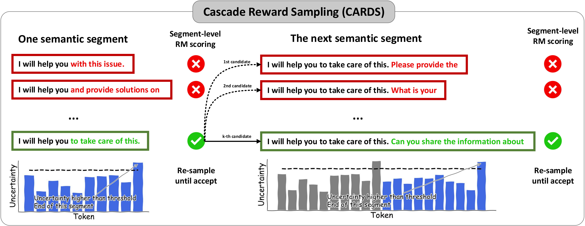

# Cascade Reward Sampling for Efficient Decoding-Time Alignment
[This paper](https://arxiv.org/pdf/2406.16306) focuses on the efficiency of decoding-time alignment, with an uncertainty-based segment-level rejection sampling algorithm proposed to balance the number of LLM & RM calls. Compared to traditional token-level reward searching, CARDS achieves higher reward and faster generation at the same time.



## Environment
```
git clone https://github.com/lblaoke/CARDS.git
cd CARDS/
conda create --name cards --file requirements.txt
conda activate cards
```

## Examples
```
from reward_sampling import RewardSampling
rs = RewardSampling(access_token=None, llm_dir='argsearch/llama-7b-sft-float32', rm_dir='argsearch/llama-7b-rm-float32')

# Text Generation
rs.rs_generate(['###Human: How are you doing today? ###Assistant:'], max_new_token=128)

# Reward Scoring
rs.rm_score(['###Human: How are you doing today? ###Assistant: I am doing well today, thank you! How may I be of service?'])
```

## Dataset Evaluations
```
CUDA_VISIBLE_DEVICES=6 python evaluation/text_generation.py --method rs --save your_name --num-test-prompt 10
```

## Citation
```
@article{li2024cascade,
  title={Cascade reward sampling for efficient decoding-time alignment},
  author={Li, Bolian and Wang, Yifan and Grama, Ananth and Zhang, Ruqi},
  journal={arXiv preprint arXiv:2406.16306},
  year={2024}
}
```
